# ARCHITECTURE.md — agentbridge system design

This document draws the system twice: a high level design (HLD) of the parts
and how data moves between them, and a low level design (LLD) of the modules,
types, and the exact steps each command runs. `DESIGN.md` explains *why* the
design is what it is; this file shows *what* the code does today.

Diagrams are Mermaid and render on GitHub and in most Markdown previews.

---

# Part 1: High level design (HLD)

## 1.1 What the system does

Every AI coding tool on a machine keeps its own sessions in its own store and
shows only a slice of them (scoped to the current directory). agentbridge reads
every store, converts each session once into every other tool's native format,
and places it where that tool's own picker will find it. Turns added in any copy
flow back so every tool sees them.

## 1.2 System context

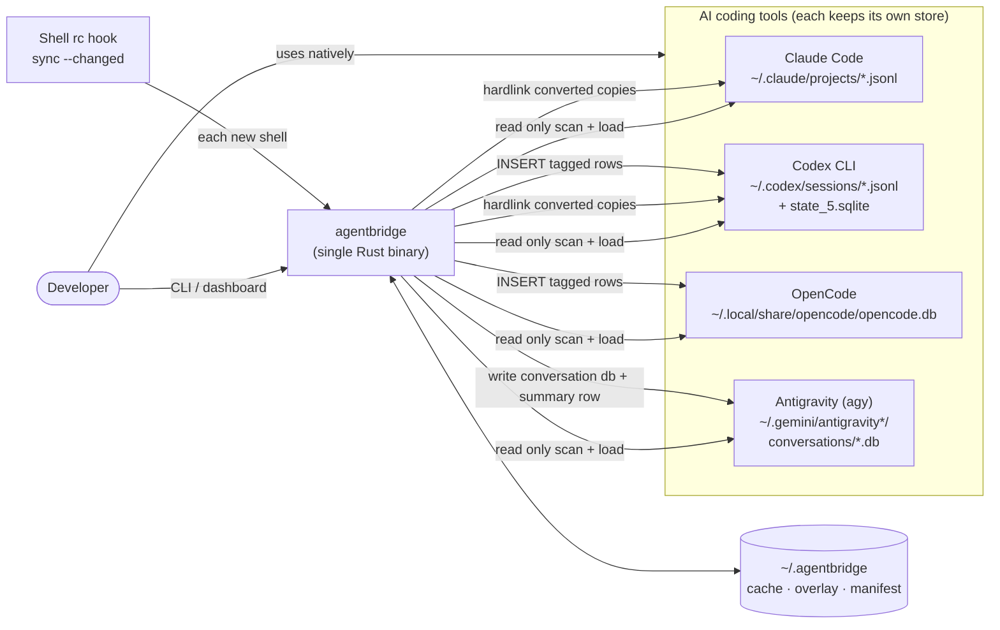

No network calls, no telemetry. Everything is local files and local SQLite.

## 1.3 Layered architecture

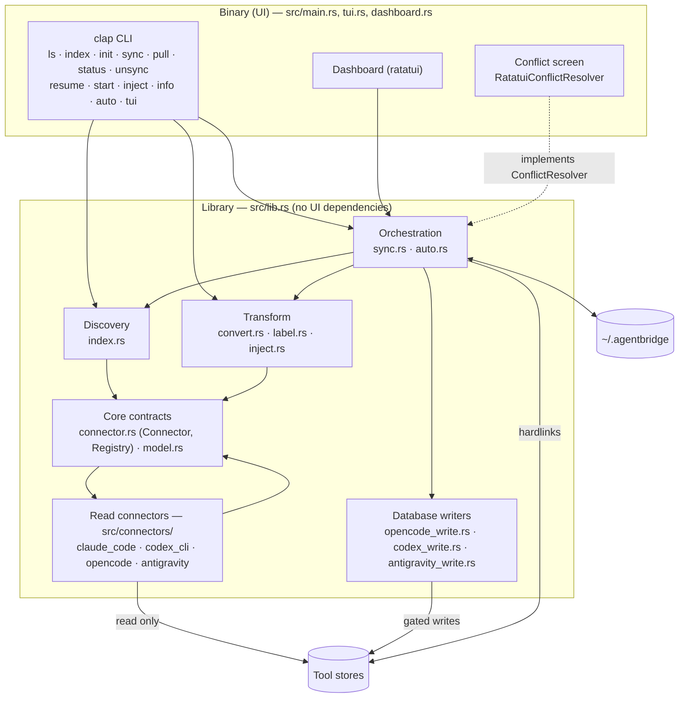

The library never imports UI code. `sync.rs` reaches the conflict screen only
through the `ConflictResolver` trait, which the binary implements.

## 1.4 Core data flow: index in place, derive once, link many

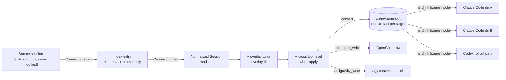

Three rules hold it together (full reasoning in `DESIGN.md` §4):

1. Never copy a session body into agentbridge. The index is metadata plus a pointer.
2. One derived artifact per session and target format, kept in `~/.agentbridge/cache`.
3. Presence in a directory is a hardlink to that artifact, not a copy.

OpenCode and Antigravity have no linkable files, so they get gated database writes instead.

## 1.5 The sync loop (write-back)

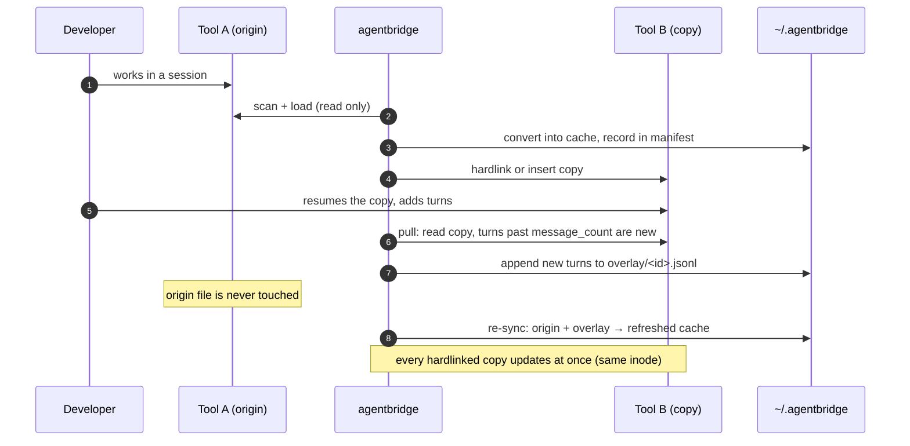

`agentbridge resume --merge` is the only opt-in exception: it sets a merge
marker so overlay turns are also written back into the origin's own file
(Claude Code and Codex only, never OpenCode or Antigravity).

## 1.6 Triggers

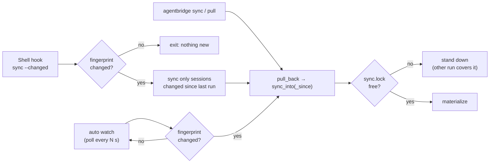

## 1.7 Storage layout owned by agentbridge

```text
~/.agentbridge/                (or $AGENTBRIDGE_DATA_DIR)
├── cache/
│   ├── claude-code/...        converted Claude Code JSONL (hardlink source)
│   └── codex-cli/...          converted Codex rollouts (hardlink source)
├── overlay/
│   ├── <session-id>.jsonl     turns recovered from other tools' copies
│   └── <session-id>.title     rename recovered from another tool
├── merge/<session-id>         opt-in marker for merge-back (resume --merge)
├── manifest.jsonl             one LinkRecord per thing agentbridge created
├── last-sync.json             { at, fingerprint } for sync --changed
└── sync.lock                  single-writer lock (stale after 30 min)
```

## 1.8 Non-functional guarantees

| Concern | How it is met |
|---|---|
| Safety of tool data | Origin files never modified; DB writes back up first, tag rows, refuse while the tool runs |
| Storage | Body stored once in cache; extra directories cost one inode entry |
| Idempotency | UUID v5 ids, paths from the session's own start time, manifest dedup |
| Reversibility | `unsync` removes exactly the manifest rows, and only when the inode still matches |
| Concurrency | `sync.lock` in the data dir; a busy run stands down |
| Loop prevention | Manifest plus self-declared copy labels (`label::is_copy`) |
| Every write previewable | `--dry-run` on every writing command |
| Privacy | No network, no telemetry |

---

# Part 2: Low level design (LLD)

## 2.1 Module map and dependencies

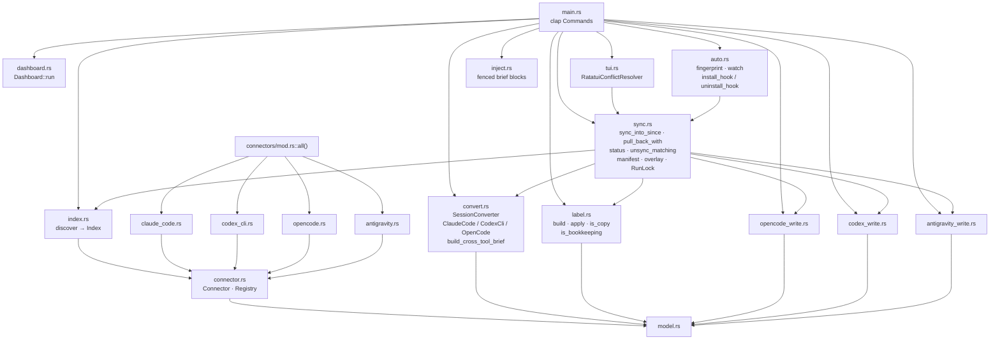

## 2.2 Core types

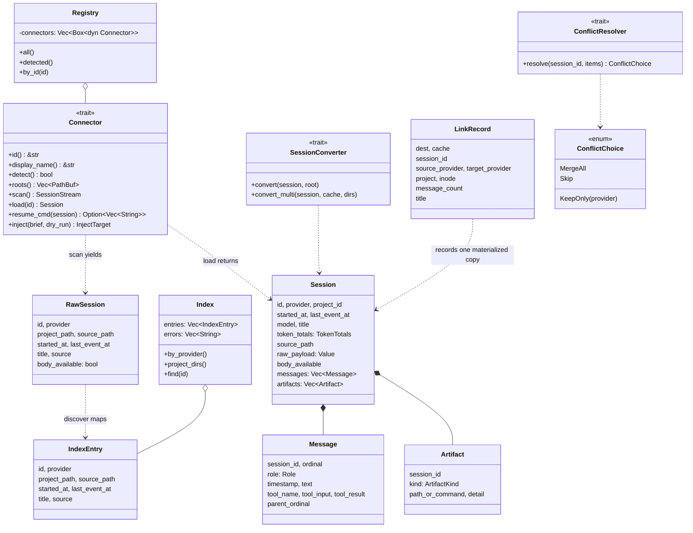

`ConflictResolver` has two implementations: `AutoMerge` (library, used by
dry-run and `auto watch`) and `RatatuiConflictResolver` (binary, interactive).

## 2.3 Connectors (read side)

| Connector `id()` | Store | Env override | Format |
|---|---|---|---|
| `claude-code` | `~/.claude/projects/<encoded-cwd>/<uuid>.jsonl` | `CLAUDE_CONFIG_DIR` | JSONL, one record per event |
| `codex-cli` | `~/.codex/sessions/YYYY/MM/DD/rollout-*.jsonl` | `CODEX_HOME` | JSONL rollout, first record `session_meta` |
| `opencode` | `$XDG_DATA_HOME/opencode/opencode.db` | `XDG_DATA_HOME` | SQLite rows (`session`, `message`, `part`) |
| `antigravity` | `~/.gemini/antigravity*/conversations/*.db` | `ANTIGRAVITY_HOME` (write only) | SQLite + hand-written protobuf reader |

Contract highlights: `detect()` is existence checks only; `scan()` is lazy and
yields one `Err` per bad session instead of aborting; SQLite is opened
`SQLITE_OPEN_READ_ONLY | SQLITE_OPEN_URI`; the project path comes from inside
the records, never from the encoded directory name.

## 2.4 Write side: how each target receives a copy

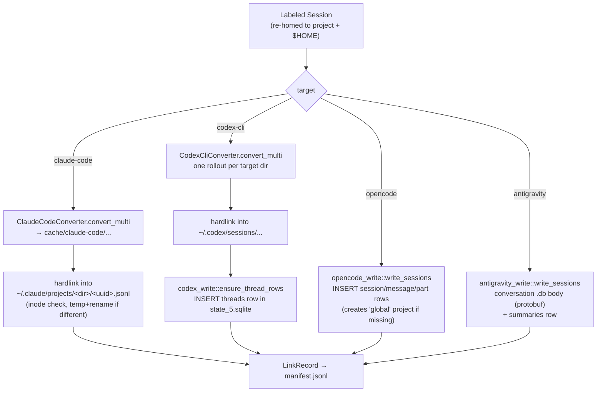

Every database writer follows the same four gates before touching another
tool's live database:

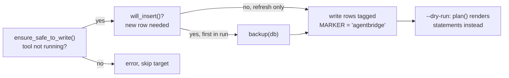

Ids are deterministic: `derive_id(source_provider, source_id, project)` is a
UUID v5, so a re-sync rewrites the same row in place and the manifest row is
updated, not appended.

## 2.5 `sync` in detail (`sync::sync_into_since`)

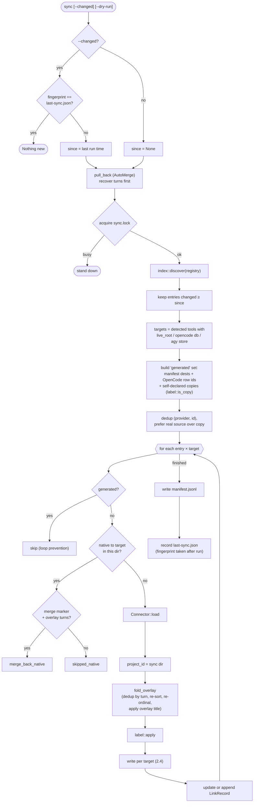

## 2.6 `pull` in detail (`sync::pull_back_with`)

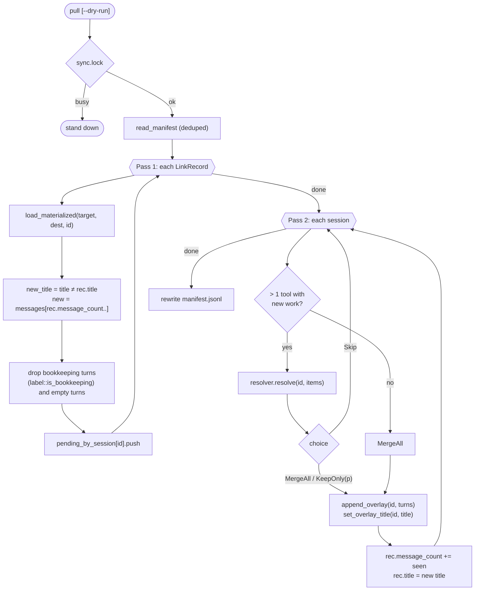

`message_count` moves by everything the copy gained, bookkeeping included, so a
dropped turn is never offered again.

## 2.7 `unsync` (`sync::unsync_matching`)

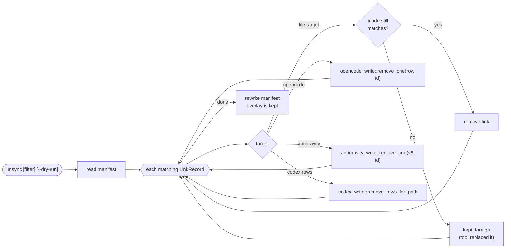

The overlay survives `unsync`: recovered work is never thrown away.

## 2.8 Other commands

| Command | Library path |
|---|---|
| `init` / `index` / `ls` | `index::discover` → print by provider and project dir. Read only |
| `status` | `sync::status` → `StatusRow::drift()` = messages on disk minus `message_count` |
| `resume <id> --in <tool> [--merge]` | load → `label::apply_for_resume` → write into the target (same writers as sync) → optional `sync::set_merge` → print the target tool's resume command (from the converter's `resume_cmd`, or `opencode run --session` / `agy --conversation`) |
| `start` | load recent sessions for the project → `convert::build_cross_tool_brief` → `inject::agentbridge_start` |
| `inject` | `Connector::inject` with fenced begin/end markers (`inject.rs`) so it can be removed exactly |
| `auto install` / `uninstall` | `auto::install_hook` / `uninstall_hook` edit a fenced block in the shell rc |
| `auto watch` | `auto::watch`: poll fingerprint, then `pull_back` + `sync_into` |
| `tui` / no args | `dashboard::Dashboard::run` |

## 2.9 Change detection (`auto::fingerprint`)

Fingerprint = `(path, size, mtime)` for every connector root's session files,
plus the `-wal` sibling of each SQLite database (WAL writes do not change the
`.db` mtime). The `-shm` file is left out of the digest because reading a
database changes it. The digest is stored in `last-sync.json` after a run, so
the copies that run wrote do not count as a change next time.

## 2.10 Copy identification (`label.rs`)

A copy must say it is a copy even without the manifest:

- Titled formats: the title is a label `provider · name · start time · id[..8]`
  naming another origin. `label::parse` / `label::strip` read it.
- Codex (no title): the first record carries an `agentbridge` origin key
  (`label::ORIGIN_KEY`), passed through `raw_payload`.
- `label::is_copy(session)` checks both, judged on the entry's own file.
- Antigravity rows are recognised by their UUID v5 id
  (`antigravity_write::is_derived_id`), because agy blanks titles on rows it
  did not write when it rebuilds its index.

## 2.11 Known gaps

- Redaction (`src/redact.rs`) required by `DESIGN.md` invariant 6 is not built yet.
- Topic threading across directories (`DESIGN.md` §10) is undecided.
- Merge-back into Antigravity and OpenCode origins is deliberately unsupported.
