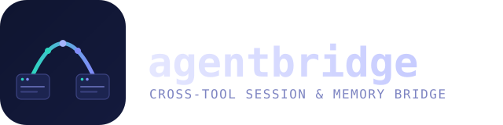

<p align="center">
  
</p>

Local-first CLI + MCP server that bridges session context across AI coding
agents (Claude Code, Codex CLI, OpenCode, Antigravity CLI, ...) running on the
same machine and the same repos.

**Status:** scaffolding stage. Connector interface and data model are in
place (see `src/connector.rs`, `src/model.rs`); no connectors are registered
yet. See `SPEC.md` for the full build spec and `DECISIONS.md` for the
language/architecture choices already made.

## What it does (once M1+ land)

- Indexes the session transcripts your agents already write to disk.
- Distills them into a compact, provenance-tracked project brief.
- Injects that brief into whichever agent you start next.
- Provides a cross-directory resume shim for agents (like Claude Code) that
  hard-scope resume to the current working directory.

See `SPEC.md` §2 for what it deliberately does **not** do (no vector-DB
memory store, no rules-file sync, no cloud service).

## Development

```bash
cargo build
cargo test
```

Requires Rust (edition 2024). See `DECISIONS.md` for why Rust was chosen over
TypeScript/Node.

## Documentation

- `SPEC.md` — the original build spec, verbatim.
- `DECISIONS.md` — language choice and every significant tradeoff, dated.
- `CONNECTORS.md` — per-provider on-disk format, as reverse-engineered (added
  as connectors land).
- `SECURITY.md` — redaction model and known limits (added in M1).

## License

MIT — see `LICENSE`.
